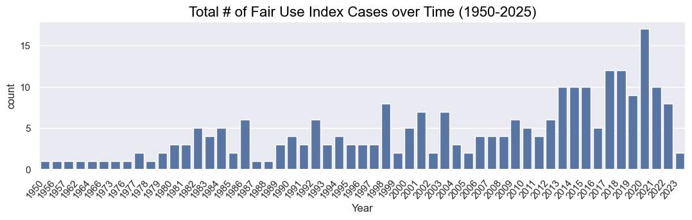
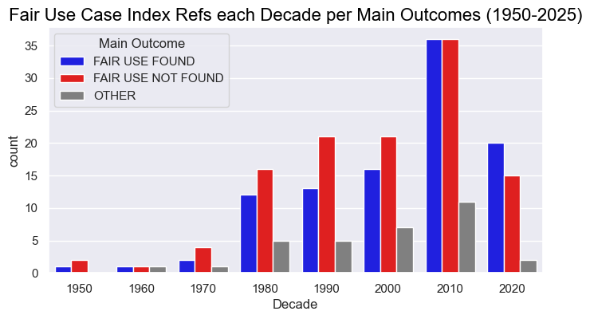
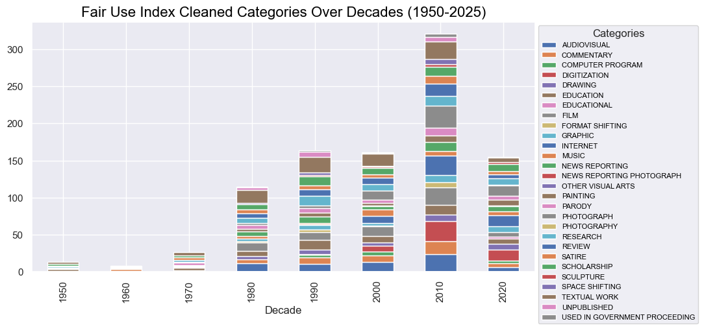

# US Govt Fair Use Index Review

## Overview 

- **Author**: [Etienne P Jacquot](mailto:etiennej@upenn.edu)
- **Date**: February 25th, 2025
- **Course**: [Penn Carey Law: LAW-9580 Cybercrime (Levy)](https://goat.law.upenn.edu/cf/coursefinder/course-details/?course=cybercrime&sec=LAW%20958001&term=2025A&page=1)
- **Statement of Academic Integrity**: *I have adhered to the academic integrity guidelines of the [Code of Academic Integrity](https://catalog.upenn.edu/pennbook/code-of-academic-integrity/) in this assignment. All of the work included (written and code), is my own and is not representative or indicative of any opinions or views of the [University of Pennsylvania](https://www.upenn.edu), the [Penn Carey Law School](https://law.upenn.edu), the [Annenberg School for Communication](https://www.asc.upenn.edu), or any other entities or individuals associated with UPenn.*
- **License & Liability**: [MIT License](./LICENSE.md)

## Getting Started

### Dataset Information

The **Fair Use Index** dataset included in this repository was copied manually from the web pages of the **[US Govt Copyright Office Fair Use Index](https://www.copyright.gov/fair-use/fair-index.html)** on February 24th, 2025.
- Excel data file:
    - [USGOVT_FairUseIndex_02-24-2025.xlsx](USGOVT_FairUseIndex_02-24-2025.xlsx)
- Consists of **6 Columns** available for **250 rows**: 
    - `Index(['Case', 'Year', 'Court', 'Jurisdiction', 'Categories', 'Outcome'], dtype='object')`

### Introduction & Discussion

This analysis is performed in a [Jupyter Notebook](https://docs.jupyter.org/en/latest/) with [Python 3.11](https://www.python.org/doc/), using the **Fair Use Index** dataset to understand the distribution of the US Govt Copyright Office referenced cases provided as reference for the public.

Focusing on **Time**, **Outcomes**, and **Categories**, the scope of this analysis focuses on *Education & Research* given my near experience as working as an IT Staff member for nearly 10 years at the Annenberg School for Communication at the University of Pennsylvania, in support of my graduate course work for LAW-9580 Cybercrime at Penn Carey Law. 

Steps taken in this coding analysis are primarily aimed at cleaning the data for inconsistencies and visualizing the cleaned data for statistics on trends in the cases referenced in the Fair Use Index dataset.

### Disclaimer on Usage of Artificial Intelligence

> Please be advised that the following AI tools were used in support of this course work, consistent with Penn Carey Law's guidance & policies on AI outlined here: [https://www.law.upenn.edu/its/docs/ai/](https://www.law.upenn.edu/its/docs/ai/)

1. **Github**: [CoPilot VSCode extension](https://code.visualstudio.com/docs/copilot/overview) was used to assist in writing and auto-generating Python code snippets throughout the Jupyter notebook analysis & scripting, along with formatting this README documentation.

2. **OpenAI**: [GPT-4o AI model](https://platform.openai.com/docs/models#gpt-4o) is used to assist in filtering all categories to differentiate parent categories from subcategories.

3. **Anthropic**: [Claude Sonnet 3.7 model](https://www.anthropic.com/claude/sonnet) was used to assist in generating the advanced reference on data visualizations generated in this analysis.

## Development

### Code Dependencies

Using **Python 3.11**, run the following to replicate the code in a local [virtual environment](https://docs.python.org/3/library/venv.html) 

- For the [analysis.ipynb](analysis.ipynb) notebook, make sure to install the dependencies in [requirements.txt](requirements.txt) file:

```bash
python3.11 -m venv .venv
source .venv/bin/activate
pip install -r requirements.txt
```

### OpenAI API Access Key

- If using OpenAI to make API calls, you must save your API key in [./secret_key.json](./secret_key.json) file.


### Cleaned Dataset Export for Reproducibility

An export of the cleaned dataset is provided for reference:
- [fui_cleaned.xlsx](fui_cleaned.xlsx)

## Data Visualizations

Below are image exports of generated data visualizations from the analysis of the Fair Use Index dataset, of which a subset of these graphs are included in my official course work submission paper.

### **Total Cases per Year**:



### **Total Cases per Decade**:


### **Main Outcomes per Decade**:




### **Categories per Decade**:




### **Categories per Year**:


### **AI Summarized Parent Categories per Year**:

> Notably, AI summarizes all available categories in the dataset into 5 or 6 parent level categories
> 1. Education & Research
> 2. Journalism & Commentary
> 3. Legal & Governance
> 4. Media & Entertainment
> 5. Technology & Digital
> 6. Visual Arts


### **AI Summarized Parent Categories per Decade**:


### **Main Outcomes per AI Summarized Parent Categories per Decade**:

#### Education & Research


#### Digital & Technology


#### Visual Arts


#### Media & Entertainment


________________

## PDF Document Review

- Using the [pdf-download.sh](./pdf-download.sh) script, download each PDF from the US Govt Fair Use Index website for review

- TBD!

```bash

## Conclusion

For questions, comments, concerns, or feedback, please feel free to reach out to me at [etiennej@upenn.edu](mailto:etiennej@upenn.edu)

### References

- [US Govt Copyright Office Fair Use Index](https://www.copyright.gov/fair-use/fair-index.html)
- [Penn Carey Law: LAW-9580 Cybercrime (Levy)](https://goat.law.upenn.edu/cf/coursefinder/course-details/?course=cybercrime&sec=LAW%20958001&term=2025A&page=1)
- [Code of Academic Integrity](https://catalog.upenn.edu/pennbook/code-of-academic-integrity/)
- [University of Pennsylvania](https://www.upenn.edu)
- [Penn Carey Law School](https://law.upenn.edu)
- [Annenberg School for Communication](https://www.asc.upenn.edu)
- [Open Source MIT License](https://opensource.org/license/mit)
